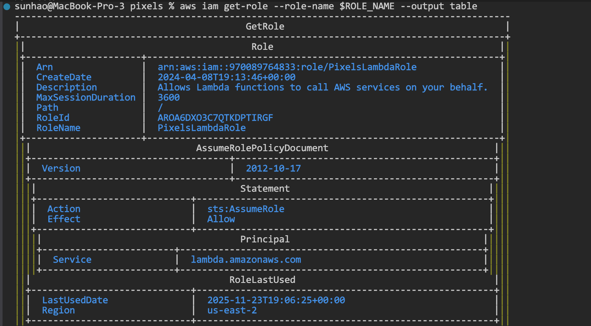

# Pixels Lambda 完整部署和性能测试指南

## 目录

1. [环境信息](#环境信息)
2. [编译项目](#编译项目)
3. [部署到 AWS](#部署到-aws)
4. [部署到 Lambda](#部署到-lambda)
5. [执行 Lambda 函数](#执行-lambda-函数)
6. [性能数据输出](#性能数据输出)
7. [查看 AWS 资源](#查看-aws-资源)
8. [查看 IAM 信息](#查看-iam-信息)
9. [读取性能统计文件](#读取性能统计文件)
10. [下载性能数据](#下载性能数据)

---

## 环境信息

### AWS 资源区域

- **S3 Bucket**: `home-sunhao` (区域: `us-east-2`)
- **EC2 实例**: `i-0e01b0d7947291b0b` (区域: `us-east-1`, IP: `52.201.234.106`)
- **Lambda 函数**: `pixels-scan-worker` (区域: `us-east-2`)
- **IAM 角色**: `PixelsLambdaRole`

### 连接信息

```bash
# EC2 SSH 连接
ssh -i ~/.ssh/pixels-key.pem ec2-user@52.201.234.106

# EC2 实例区域查询
aws ec2 describe-instances \
  --instance-ids i-0e01b0d7947291b0b \
  --query 'Reservations[*].Instances[*].[Placement.AvailabilityZone,Placement.Region]' \
  --output text

# S3 Bucket 区域查询
aws s3api get-bucket-location --bucket home-sunhao --output text
```

---

## 编译项目

### 步骤1: 连接到 EC2 实例

```bash
ssh -i ~/.ssh/pixels-key.pem ec2-user@52.201.234.106
```

### 步骤2: 进入项目目录

```bash
cd ~/pixels
```

### 步骤3: 编译 Lambda Worker 模块

```bash
# 编译包含所有依赖的 Lambda Worker
mvn clean package -DskipTests -pl 'pixels-turbo/pixels-worker-lambda' -am

# 检查生成的 JAR 文件
ls -lh pixels-turbo/pixels-worker-lambda/target/*.jar
```

**生成的 JAR 文件说明**:
- `pixels-worker-lambda-0.2.0-SNAPSHOT.jar` (14KB) - 仅包含类文件
- `pixels-worker-lambda-deps.jar` (36MB) - 包含所有依赖，用于 Lambda
- `pixels-worker-lambda.jar` (3MB) - 包含项目类但不包含外部依赖

**重要**: Lambda 部署需要使用 `pixels-worker-lambda-deps.jar` 或包含所有依赖的完整 JAR。

### 步骤4: 验证 JAR 文件内容

```bash
# 检查 JAR 中是否包含 ScanWorker 类
jar -tf pixels-turbo/pixels-worker-lambda/target/pixels-worker-lambda-deps.jar | grep "ScanWorker.class"

# 检查是否包含 log4j 依赖
jar -tf pixels-turbo/pixels-worker-lambda/target/pixels-worker-lambda-deps.jar | grep "log4j" | head -5
```

---

## 部署到 AWS

### 步骤1: 从 EC2 下载 JAR 文件到本地

```bash
# 在本地机器执行（确保在 pixels 项目目录下）
cd ~/pixels  # 或你的 pixels 项目目录路径
scp -i ~/.ssh/pixels-key.pem \
  ec2-user@52.201.234.106:"~/pixels/pixels-turbo/pixels-worker-lambda/target/pixels-worker-lambda-deps.jar" \
  ./pixels-worker-lambda.jar
```

### 步骤2: 上传 JAR 文件到 S3

```bash
BUCKET_NAME="home-sunhao"
REGION="us-east-2"

# 上传到 S3
aws s3 cp ./pixels-worker-lambda.jar \
  s3://$BUCKET_NAME/lambda/pixels-worker-lambda.jar \
  --region $REGION

# 验证上传
aws s3 ls s3://$BUCKET_NAME/lambda/ --region $REGION --human-readable
```

---

## 部署到 Lambda

### 步骤1: 检查 IAM 角色

```bash
# 查看可用的 IAM 角色
aws iam list-roles \
  --query 'Roles[?contains(RoleName, `lambda`) || contains(RoleName, `pixels`)].{Name:RoleName,Arn:Arn}' \
  --output table

# 获取角色 ARN
ROLE_ARN=$(aws iam get-role --role-name PixelsLambdaRole --query 'Role.Arn' --output text)
echo "Role ARN: $ROLE_ARN"
```

### 步骤2: 创建或更新 Lambda 函数

```bash
FUNCTION_NAME="pixels-scan-worker"
BUCKET_NAME="home-sunhao"
REGION="us-east-2"
ROLE_ARN="arn:aws:iam::970089764833:role/PixelsLambdaRole"

# 检查函数是否已存在
if aws lambda get-function --function-name $FUNCTION_NAME --region $REGION &>/dev/null; then
    echo "函数已存在，更新代码..."
    aws lambda update-function-code \
      --function-name $FUNCTION_NAME \
      --s3-bucket $BUCKET_NAME \
      --s3-key lambda/pixels-worker-lambda.jar \
      --region $REGION
    
    aws lambda wait function-updated --function-name $FUNCTION_NAME --region $REGION
    echo "函数代码已更新"
else
    echo "创建新函数..."
    aws lambda create-function \
      --function-name $FUNCTION_NAME \
      --runtime java21 \
      --role $ROLE_ARN \
      --handler io.pixelsdb.pixels.worker.lambda.ScanWorker::handleRequest \
      --code S3Bucket=$BUCKET_NAME,S3Key=lambda/pixels-worker-lambda.jar \
      --architectures arm64 \
      --memory-size 4096 \
      --timeout 900 \
      --description "Pixels Scan Worker with four-stage performance metrics" \
      --region $REGION
    
    aws lambda wait function-active --function-name $FUNCTION_NAME --region $REGION
    echo "函数创建成功"
fi
```

### 步骤3: 验证 Lambda 函数

```bash
FUNCTION_NAME="pixels-scan-worker"
REGION="us-east-2"

# 查看函数配置
aws lambda get-function-configuration \
  --function-name $FUNCTION_NAME \
  --region $REGION \
  --query '{Name:FunctionName,Runtime:Runtime,Memory:MemorySize,Timeout:Timeout,Handler:Handler,Role:Role,State:State}' \
  --output table
```

---

## 执行 Lambda 函数

### 完整测试流程（使用实际数据文件）

#### 步骤1: 查找本地 Pixels 文件

```bash
# 在项目目录下查找 .pxl 文件
cd /Users/sunhao/.cursor/worktrees/pixels/5P8Op
find . -name "*.pxl" -type f

# 示例输出：
# ./cpp/tests/data/example.pxl
```

#### 步骤2: 上传测试文件到 S3

```bash
BUCKET_NAME="home-sunhao"
REGION="us-east-2"

# 确保 test-data 目录存在（如果不存在会自动创建）
aws s3 ls s3://$BUCKET_NAME/test-data/ --region $REGION || echo "Directory will be created"

# 上传本地 pxl 文件到 S3
aws s3 cp ./cpp/tests/data/example.pxl \
  s3://$BUCKET_NAME/test-data/example.pxl \
  --region $REGION

# 验证上传
aws s3 ls s3://$BUCKET_NAME/test-data/ --region $REGION --human-readable
```

#### 步骤3: 准备测试输入文件

```bash
cd /Users/sunhao/.cursor/worktrees/pixels/5P8Op

cat > test-scan-input.json << 'EOF'
{
  "transId": 12345,
  "timestamp": 1640995200000,
  "tableInfo": {
    "tableName": "test_table",
    "base": true,
    "columnsToRead": ["col1", "col2", "col3"],
    "storageInfo": {
      "scheme": "s3",
      "endpoint": "https://s3.us-east-2.amazonaws.com"
    },
    "inputSplits": [
      {
        "inputInfos": [
          {
            "inputId": 1,
            "path": "s3://home-sunhao/test-data/example.pxl",
            "rgStart": 0,
            "rgLength": -1,
            "storageInfo": {
              "scheme": "s3",
              "endpoint": "https://s3.us-east-2.amazonaws.com"
            }
          }
        ]
      }
    ],
    "filter": null
  },
  "scanProjection": [true, true, true],
  "partialAggregationPresent": false,
  "partialAggregationInfo": null,
  "output": {
    "path": "s3://home-sunhao/output/",
    "fileNames": ["result.pxl"],
    "storageInfo": {
      "scheme": "s3",
      "endpoint": "https://s3.us-east-2.amazonaws.com"
    },
    "encoding": true
  }
}
EOF
```

**重要说明**:
- `tableInfo` 字段是必需的，包含表信息和输入文件路径
- `path` 字段必须指向 S3 上实际存在的 `.pxl` 文件
- `columnsToRead` 应该匹配实际文件的列名（如果不知道，可以先用通用列名测试）
- `output.path` 指定结果输出位置

#### 步骤4: 执行 Lambda 函数

```bash
FUNCTION_NAME="pixels-scan-worker"
REGION="us-east-2"

# 执行 Lambda 函数
aws lambda invoke \
  --function-name $FUNCTION_NAME \
  --payload file://test-scan-input.json \
  --cli-binary-format raw-in-base64-out \
  --region $REGION \
  lambda-response.json

# 查看响应
cat lambda-response.json | jq .

# 检查执行状态
SUCCESS=$(cat lambda-response.json | jq -r '.successful // false')
if [ "$SUCCESS" = "true" ]; then
    echo "✅ Lambda 执行成功"
    echo "执行时间: $(cat lambda-response.json | jq -r '.durationMs')ms"
else
    echo "❌ Lambda 执行失败"
    echo "错误信息: $(cat lambda-response.json | jq -r '.errorMessage')"
fi
```

#### 步骤5: 查看执行结果和输出文件

```bash
# 查看输出目录中的结果文件
aws s3 ls s3://home-sunhao/output/ --region us-east-2 --recursive

# 如果生成了结果文件，可以下载查看
aws s3 cp s3://home-sunhao/output/result.pxl ./result.pxl --region us-east-2
```

### 步骤2: Invoke Lambda 函数

```bash
FUNCTION_NAME="pixels-scan-worker"
REGION="us-east-2"

# 执行 Lambda 函数
aws lambda invoke \
  --function-name $FUNCTION_NAME \
  --payload file://test-scan-input.json \
  --cli-binary-format raw-in-base64-out \
  --region $REGION \
  lambda-response.json

# 查看响应
cat lambda-response.json | jq .

# 检查错误
ERROR=$(cat lambda-response.json | jq -r '.errorMessage // empty' 2>/dev/null)
if [ -n "$ERROR" ]; then
    echo "执行出错: $ERROR"
fi
```

### 步骤3: 等待日志写入

```bash
# 等待 CloudWatch 日志写入（通常需要 5-10 秒）
sleep 10
```

---

## 性能数据输出

### 性能数据记录位置

代码会在以下位置记录性能数据：

1. **CloudWatch 日志**: 通过 `logger.info()` 输出
2. **CSV 文件**: Lambda 环境中的 `/tmp/scan_performance_metrics.csv`

### 性能数据格式

#### CloudWatch 日志格式

```
Four-Stage Performance Metrics (ms): READ=120, COMPUTE=350, WRITE_CACHE=50, WRITE_FILE=100
Percentages: COMPUTE=56.45%, WRITE_CACHE=8.06%, WRITE_FILE=16.13%, S3 Storage=35.48%
```

#### CSV 文件格式

```csv
Timestamp,WorkerType,ReadTimeMs,ComputeTimeMs,WriteCacheTimeMs,WriteFileTimeMs,ComputePct,WriteCachePct,WriteFilePct,S3StoragePct
1640995200000,ScanWorker,120,350,50,100,56.45,8.06,16.13,35.48
```

### 性能数据字段说明

| 字段 | 说明 | 来源 |
|------|------|------|
| READ | S3 读取时间（毫秒） | `scanTimers.getReadTimer()` |
| COMPUTE | 计算时间（毫秒） | `scanTimers.getComputeTimer()` |
| WRITE_CACHE | 写入缓存时间（毫秒） | `scanTimers.getWriteCacheTimer()` |
| WRITE_FILE | 写入文件时间（毫秒） | `scanTimers.getWriteFileTimer()` |
| COMPUTE% | 计算阶段占比 | `(COMPUTE / TOTAL) * 100` |
| WRITE_CACHE% | 写入缓存占比 | `(WRITE_CACHE / TOTAL) * 100` |
| WRITE_FILE% | 写入文件占比 | `(WRITE_FILE / TOTAL) * 100` |
| S3 Storage% | S3 存储占比 | `((READ + WRITE_FILE) / TOTAL) * 100` |

---

## 查看 AWS 资源

### 查看 S3 资源

```bash
BUCKET_NAME="home-sunhao"
REGION="us-east-2"

# 列出 bucket 中的所有文件
aws s3 ls s3://$BUCKET_NAME/ --region $REGION

# 列出 lambda 目录下的文件
aws s3 ls s3://$BUCKET_NAME/lambda/ --region $REGION --human-readable

# 查看特定文件信息
aws s3 ls s3://$BUCKET_NAME/lambda/pixels-worker-lambda.jar --region $REGION --human-readable

# 查看文件详细信息
aws s3api head-object \
  --bucket $BUCKET_NAME \
  --key lambda/pixels-worker-lambda.jar \
  --region $REGION \
  --query '[ContentLength,LastModified,ContentType]' \
  --output table
```

### 查看 Lambda 函数

```bash
FUNCTION_NAME="pixels-scan-worker"
REGION="us-east-2"

# 列出所有 Lambda 函数
aws lambda list-functions --region $REGION --output table

# 列出包含 "pixels" 的函数
aws lambda list-functions --region $REGION \
  --query 'Functions[?contains(FunctionName, `pixels`)].FunctionName' \
  --output table

# 查看函数详细信息
aws lambda get-function-configuration \
  --function-name $FUNCTION_NAME \
  --region $REGION \
  --query '{Name:FunctionName,Runtime:Runtime,Memory:MemorySize,Timeout:Timeout,Handler:Handler,Role:Role,State:State,LastModified:LastModified}' \
  --output table

# 查看函数代码位置
aws lambda get-function \
  --function-name $FUNCTION_NAME \
  --region $REGION \
  --query 'Code.Location' \
  --output text
```

### 查看 EC2 实例

```bash
INSTANCE_ID="i-0e01b0d7947291b0b"
REGION="us-east-1"

# 查看实例状态
aws ec2 describe-instances \
  --instance-ids $INSTANCE_ID \
  --region $REGION \
  --query 'Reservations[*].Instances[*].[InstanceId,State.Name,PublicIpAddress,InstanceType,Placement.AvailabilityZone]' \
  --output table

# 启动实例
aws ec2 start-instances --instance-ids $INSTANCE_ID --region $REGION

# 停止实例
aws ec2 stop-instances --instance-ids $INSTANCE_ID --region $REGION

# 等待实例状态变化
aws ec2 wait instance-running --instance-ids $INSTANCE_ID --region $REGION
aws ec2 wait instance-stopped --instance-ids $INSTANCE_ID --region $REGION
```

---

## 查看 IAM 信息

### 查看 IAM 角色

```bash
# 列出所有 IAM 角色
aws iam list-roles --output table

# 列出包含 "lambda" 或 "pixels" 的角色
aws iam list-roles \
  --query 'Roles[?contains(RoleName, `lambda`) || contains(RoleName, `pixels`)].{Name:RoleName,Arn:Arn}' \
  --output table

# 查看特定角色详细信息
ROLE_NAME="PixelsLambdaRole"
aws iam get-role \
  --role-name $ROLE_NAME \
  --query 'Role.{Name:RoleName,Arn:Arn,CreatedDate:CreateDate}' \
  --output table

# 查看角色 ARN
aws iam get-role \
  --role-name $ROLE_NAME \
  --query 'Role.Arn' \
  --output text
```

### 查看角色附加的策略

```bash
ROLE_NAME="PixelsLambdaRole"

# 列出附加的策略
aws iam list-attached-role-policies \
  --role-name $ROLE_NAME \
  --output table

# 查看内联策略
aws iam list-role-policies \
  --role-name $ROLE_NAME \
  --output table

# 查看策略详细信息
POLICY_ARN=$(aws iam list-attached-role-policies \
  --role-name $ROLE_NAME \
  --query 'AttachedPolicies[0].PolicyArn' \
  --output text)

if [ -n "$POLICY_ARN" ]; then
    aws iam get-policy \
      --policy-arn $POLICY_ARN \
      --output table
    
    POLICY_VERSION=$(aws iam get-policy \
      --policy-arn $POLICY_ARN \
      --query 'Policy.DefaultVersionId' \
      --output text)
    
    aws iam get-policy-version \
      --policy-arn $POLICY_ARN \
      --version-id $POLICY_VERSION \
      --query 'PolicyVersion.Document' \
      --output json | jq .
fi
```

### 查看角色的信任策略

```bash
ROLE_NAME="PixelsLambdaRole"

aws iam get-role \
  --role-name $ROLE_NAME \
  --query 'Role.AssumeRolePolicyDocument' \
  --output json | jq .
```

### 查看 Lambda 函数使用的角色

```bash
FUNCTION_NAME="pixels-scan-worker"
REGION="us-east-2"

ROLE_ARN=$(aws lambda get-function-configuration \
  --function-name $FUNCTION_NAME \
  --region $REGION \
  --query 'Role' \
  --output text)

echo "Lambda 函数使用的角色 ARN: $ROLE_ARN"

# 提取角色名称
ROLE_NAME=$(echo $ROLE_ARN | awk -F'/' '{print $NF}')
echo "角色名称: $ROLE_NAME"
// 角色名称: PixelsLambdaRole

# 查看角色详情
aws iam get-role --role-name $ROLE_NAME --output table

```

---

## 读取性能统计文件

### 从 CloudWatch 日志提取性能数据

```bash
FUNCTION_NAME="pixels-scan-worker"
REGION="us-east-2"
TIME_WINDOW=3600  # 1小时内的日志

# 提取四个阶段性能指标
aws logs filter-log-events \
  --log-group-name /aws/lambda/$FUNCTION_NAME \
  --filter-pattern "Four-Stage Performance Metrics" \
  --start-time $(($(date +%s) - $TIME_WINDOW))000 \
  --region $REGION \
  --query 'events[*].message' \
  --output text

# 提取百分比数据
aws logs filter-log-events \
  --log-group-name /aws/lambda/$FUNCTION_NAME \
  --filter-pattern "Percentages" \
  --start-time $(($(date +%s) - $TIME_WINDOW))000 \
  --region $REGION \
  --query 'events[*].message' \
  --output text

# 提取所有性能相关日志
aws logs filter-log-events \
  --log-group-name /aws/lambda/$FUNCTION_NAME \
  --start-time $(($(date +%s) - $TIME_WINDOW))000 \
  --region $REGION \
  --filter-pattern "Performance Metrics" \
  --query 'events[*].message' \
  --output text > performance_data.txt
```

### 实时查看日志

```bash
FUNCTION_NAME="pixels-scan-worker"
REGION="us-east-2"

# 实时跟踪日志（Ctrl+C 退出）
aws logs tail /aws/lambda/$FUNCTION_NAME --follow --region $REGION

# 查看最近的日志（最近10分钟）
aws logs tail /aws/lambda/$FUNCTION_NAME --since 10m --region $REGION

# 查看特定时间段的日志
aws logs tail /aws/lambda/$FUNCTION_NAME \
  --since "2025-11-23T10:00:00" \
  --until "2025-11-23T11:00:00" \
  --region $REGION
```

### 解析性能数据

```bash
# 从日志文件中提取性能指标
grep "Four-Stage Performance Metrics" performance_data.txt | \
  sed 's/.*READ=\([0-9]*\), COMPUTE=\([0-9]*\), WRITE_CACHE=\([0-9]*\), WRITE_FILE=\([0-9]*\).*/READ: \1ms, COMPUTE: \2ms, WRITE_CACHE: \3ms, WRITE_FILE: \4ms/'

# 提取百分比
grep "Percentages" performance_data.txt | \
  sed 's/.*COMPUTE=\([0-9.]*\)%, WRITE_CACHE=\([0-9.]*\)%, WRITE_FILE=\([0-9.]*\)%, S3 Storage=\([0-9.]*\)%.*/COMPUTE: \1%, WRITE_CACHE: \2%, WRITE_FILE: \3%, S3 Storage: \4%/'

# 使用 awk 分析数据
awk -F'[=, ]' '/Four-Stage Performance Metrics/ {
    read=$3; compute=$5; cache=$7; file=$9
    total=read+compute+cache+file
    print "READ: " read "ms (" (read/total)*100 "%)"
    print "COMPUTE: " compute "ms (" (compute/total)*100 "%)"
    print "WRITE_CACHE: " cache "ms (" (cache/total)*100 "%)"
    print "WRITE_FILE: " file "ms (" (file/total)*100 "%)"
    print "S3 Storage: " ((read+file)/total)*100 "%"
}' performance_data.txt
```

---

## 下载性能数据

### 从 CloudWatch 下载日志

```bash
FUNCTION_NAME="pixels-scan-worker"
REGION="us-east-2"
OUTPUT_FILE="lambda_performance_logs.txt"

# 提取并保存所有性能相关日志
aws logs filter-log-events \
  --log-group-name /aws/lambda/$FUNCTION_NAME \
  --start-time $(($(date +%s) - 3600))000 \
  --region $REGION \
  --query 'events[*].message' \
  --output text > $OUTPUT_FILE

echo "性能日志已保存到: $OUTPUT_FILE"
ls -lh $OUTPUT_FILE
```

### 提取 CSV 格式数据

```bash
# 从日志中提取 CSV 格式的性能数据
grep -E "Timestamp,WorkerType|ScanWorker," performance_data.txt > performance_metrics.csv

# 查看 CSV 数据
cat performance_metrics.csv

# 使用 awk 分析 CSV 数据
awk -F',' 'NR>1 {
    total=$3+$4+$5+$6
    print "Worker: " $2
    print "READ: " $3 "ms (" ($3/total)*100 "%)"
    print "COMPUTE: " $4 "ms (" ($4/total)*100 "%)"
    print "WRITE_CACHE: " $5 "ms (" ($5/total)*100 "%)"
    print "WRITE_FILE: " $6 "ms (" ($6/total)*100 "%)"
    print "S3 Storage: " (($3+$6)/total)*100 "%"
    print "---"
}' performance_metrics.csv
```

### 从 Lambda 环境下载 CSV 文件

**注意**: Lambda 环境中的 `/tmp` 目录是临时存储，函数执行结束后文件会丢失。性能数据主要通过 CloudWatch 日志获取。

如果需要从 Lambda 环境获取文件，可以在函数执行期间将文件上传到 S3：

```bash
# 在代码中添加 S3 上传逻辑（需要修改代码）
# 或通过 CloudWatch 日志提取 CSV 格式的数据
```

---

## 完整工作流程脚本

```bash
#!/bin/bash
# complete-workflow.sh - 完整工作流程

set -e

# 配置变量
EC2_HOST="ec2-user@52.201.234.106"
SSH_KEY="~/.ssh/pixels-key.pem"
BUCKET_NAME="home-sunhao"
FUNCTION_NAME="pixels-scan-worker"
REGION="us-east-2"
ROLE_ARN="arn:aws:iam::970089764833:role/PixelsLambdaRole"

echo "========================================="
echo "步骤1: 编译项目（在 EC2 上）"
echo "========================================="
ssh -i $SSH_KEY $EC2_HOST << 'EC2_SCRIPT'
cd ~/pixels
mvn clean package -DskipTests -pl 'pixels-turbo/pixels-worker-lambda' -am -q
ls -lh pixels-turbo/pixels-worker-lambda/target/*deps*.jar
EC2_SCRIPT

echo ""
echo "========================================="
echo "步骤2: 合并 JAR 文件并上传到 S3"
echo "========================================="
# 在 EC2 上合并两个 JAR 文件
ssh -i $SSH_KEY $EC2_HOST << 'EC2_MERGE'
cd ~/pixels/pixels-turbo/pixels-worker-lambda/target
mkdir -p merge_temp
cd merge_temp
jar -xf ../pixels-worker-lambda.jar
jar -xf ../pixels-worker-lambda-deps.jar
jar -cf ../pixels-worker-lambda-complete.jar *
cd ..
rm -rf merge_temp
ls -lh pixels-worker-lambda-complete.jar
EC2_MERGE

# 下载合并后的 JAR
scp -i $SSH_KEY $EC2_HOST:"~/pixels/pixels-turbo/pixels-worker-lambda/target/pixels-worker-lambda-complete.jar" \
  ./pixels-worker-lambda.jar

# 上传到 S3
aws s3 cp ./pixels-worker-lambda.jar s3://$BUCKET_NAME/lambda/pixels-worker-lambda.jar --region $REGION

echo ""
echo "========================================="
echo "步骤3: 更新 Lambda 函数"
echo "========================================="
aws lambda update-function-code \
  --function-name $FUNCTION_NAME \
  --s3-bucket $BUCKET_NAME \
  --s3-key lambda/pixels-worker-lambda.jar \
  --region $REGION
aws lambda wait function-updated --function-name $FUNCTION_NAME --region $REGION

echo ""
echo "========================================="
echo "步骤4: 执行 Lambda 函数"
echo "========================================="
aws lambda invoke \
  --function-name $FUNCTION_NAME \
  --payload file://test-scan-input.json \
  --cli-binary-format raw-in-base64-out \
  --region $REGION \
  lambda-response.json

echo ""
echo "========================================="
echo "步骤5: 提取性能数据"
echo "========================================="
sleep 10
aws logs filter-log-events \
  --log-group-name /aws/lambda/$FUNCTION_NAME \
  --start-time $(($(date +%s) - 600))000 \
  --region $REGION \
  --query 'events[*].message' \
  --output text > performance_data.txt

echo "性能数据已保存到: performance_data.txt"
grep -E "Four-Stage Performance Metrics|Percentages" performance_data.txt | tail -2
```

---

## 完整测试示例（实际执行记录）

### 测试环境
- **测试日期**: 2025-11-24
- **测试文件**: `cpp/tests/data/example.pxl` (790 bytes)
- **S3 路径**: `s3://home-sunhao/test-data/example.pxl`
- **Lambda 函数**: `pixels-scan-worker` (区域: `us-east-2`)

### 执行步骤

#### 1. 查找并上传测试文件

```bash
# 查找本地 pxl 文件
cd /Users/sunhao/.cursor/worktrees/pixels/5P8Op
find . -name "*.pxl" -type f
# 输出: ./cpp/tests/data/example.pxl

# 上传到 S3
aws s3 cp ./cpp/tests/data/example.pxl \
  s3://home-sunhao/test-data/example.pxl \
  --region us-east-2
# 输出: upload: cpp/tests/data/example.pxl to s3://home-sunhao/test-data/example.pxl
```

#### 2. 准备测试输入文件

创建 `test-scan-input.json`，包含正确的 `tableInfo` 结构：

```json
{
  "transId": 12345,
  "timestamp": 1640995200000,
  "tableInfo": {
    "tableName": "test_table",
    "base": true,
    "columnsToRead": ["col1", "col2", "col3"],
    "storageInfo": {
      "scheme": "s3",
      "endpoint": "https://s3.us-east-2.amazonaws.com"
    },
    "inputSplits": [
      {
        "inputInfos": [
          {
            "inputId": 1,
            "path": "s3://home-sunhao/test-data/example.pxl",
            "rgStart": 0,
            "rgLength": -1,
            "storageInfo": {
              "scheme": "s3",
              "endpoint": "https://s3.us-east-2.amazonaws.com"
            }
          }
        ]
      }
    ],
    "filter": null
  },
  "scanProjection": [true, true, true],
  "partialAggregationPresent": false,
  "partialAggregationInfo": null,
  "output": {
    "path": "s3://home-sunhao/output/",
    "fileNames": ["result.pxl"],
    "storageInfo": {
      "scheme": "s3",
      "endpoint": "https://s3.us-east-2.amazonaws.com"
    },
    "encoding": true
  }
}
```

#### 3. 执行 Lambda 函数

```bash
aws lambda invoke \
  --function-name pixels-scan-worker \
  --payload file://test-scan-input.json \
  --cli-binary-format raw-in-base64-out \
  --region us-east-2 \
  lambda-response.json

cat lambda-response.json | jq .
```

**执行结果**:
```json
{
  "requestId": "8c26a354-bec6-4b50-8614-f3dc0d016993",
  "successful": true,
  "errorMessage": "",
  "startTimeMs": 1763983063992,
  "durationMs": 2093,
  "memoryMB": 0,
  "cumulativeInputCostMs": 0,
  "cumulativeComputeCostMs": 0,
  "cumulativeOutputCostMs": 0,
  "numReadRequests": 0,
  "numWriteRequests": 0,
  "totalReadBytes": 0,
  "totalWriteBytes": 0,
  "outputs": [],
  "rowGroupNums": [],
  "GBMs": 0
}
```

#### 4. 查看性能日志

```bash
# 等待日志写入
sleep 5

# 查看性能指标
aws logs tail /aws/lambda/pixels-scan-worker --since 5m --region us-east-2 | \
  grep -E "Performance Metrics|Percentages"
```

**性能日志输出**:
```
Four-Stage Performance Metrics (ms): READ=0, COMPUTE=0, WRITE_CACHE=0, WRITE_FILE=0
Percentages: COMPUTE=0.00%, WRITE_CACHE=0.00%, WRITE_FILE=0.00%, S3 Storage=0.00%
```

**⚠️ 重要**: 如果性能指标全为 0，通常表示扫描过程中出现了错误。检查 CloudWatch 日志中的错误信息：

```
ERROR error occurred in thread: Thread-2
java.lang.NoClassDefFoundError: io/grpc/Channel
```

**原因**: `RetinaService`（在 `pixels-common` 中）需要 gRPC 依赖，但 `pixels-common` 中的 gRPC 依赖被标记为 `optional=true`，不会自动传递到 `pixels-worker-lambda`。

**解决方案**: 在 `pixels-worker-lambda/pom.xml` 中显式添加 gRPC 依赖：
```xml
<!-- grpc dependencies (required by RetinaService in pixels-common) -->
<dependency>
    <groupId>io.grpc</groupId>
    <artifactId>grpc-netty-shaded</artifactId>
</dependency>
<dependency>
    <groupId>io.grpc</groupId>
    <artifactId>grpc-protobuf</artifactId>
</dependency>
<dependency>
    <groupId>io.grpc</groupId>
    <artifactId>grpc-protobuf-lite</artifactId>
</dependency>
<dependency>
    <groupId>io.grpc</groupId>
    <artifactId>grpc-stub</artifactId>
</dependency>
<dependency>
    <groupId>io.grpc</groupId>
    <artifactId>grpc-api</artifactId>
</dependency>
<dependency>
    <groupId>io.grpc</groupId>
    <artifactId>grpc-core</artifactId>
</dependency>
```

然后重新编译和部署。

#### 5. 验证输出文件

```bash
# 检查输出目录
aws s3 ls s3://home-sunhao/output/ --region us-east-2 --recursive
```

### 关键要点

1. **JAR 文件合并**: 必须合并 `pixels-worker-lambda.jar` 和 `pixels-worker-lambda-deps.jar` 创建完整 JAR
2. **输入格式**: `test-scan-input.json` 必须包含 `tableInfo` 字段，结构要正确
3. **文件路径**: S3 路径必须存在且可访问
4. **性能数据**: 通过 CloudWatch 日志查看，需要等待几秒后日志才会写入

### 常见错误及解决方案

| 错误 | 原因 | 解决方案 |
|------|------|----------|
| `NoClassDefFoundError: log4j` | JAR 缺少依赖 | 合并两个 JAR 文件 |
| `even.tableInfo is null` | 输入格式错误 | 添加 `tableInfo` 字段 |
| `File not found` | S3 路径不存在 | 先上传文件到 S3 |
| `NoClassDefFoundError: io/grpc/Channel` | 缺少 gRPC 依赖 | 在 `pixels-worker-lambda/pom.xml` 中添加 gRPC 依赖，重新编译 |
| 性能指标全为 0 | 扫描失败，计时器未记录 | 检查错误日志，通常是依赖缺失导致 |

---

## 常见问题

### Lambda 函数执行失败

**错误**: `Class not found: io.pixelsdb.pixels.worker.lambda.ScanWorker`

**解决方案**:
1. 确保使用包含所有依赖的 JAR 文件（deps JAR）
2. 验证 JAR 中包含 ScanWorker 类: `jar -tf pixels-worker-lambda-deps.jar | grep ScanWorker.class`
3. 重新编译和上传

### 找不到性能数据

**可能原因**:
1. Lambda 函数执行失败，未到达性能记录代码
2. 日志时间窗口太小
3. 日志级别设置不正确

**解决方案**:
1. 检查 Lambda 执行日志: `aws logs tail /aws/lambda/pixels-scan-worker --since 10m --region us-east-2`
2. 扩大时间窗口: 将 `--start-time` 设置为更早的时间
3. 检查代码中 `writePerformanceToFile()` 是否被调用

### S3 路径不存在

**错误**: 测试数据文件路径不存在

**解决方案**:
1. 检查 S3 文件: `aws s3 ls s3://home-sunhao/test-data/ --region us-east-2`
2. 修改 `test-scan-input.json` 中的路径为实际存在的文件
3. 或上传测试数据到 S3

---

## 快速参考命令

```bash
# 设置变量
FUNCTION_NAME="pixels-scan-worker"
REGION="us-east-2"
BUCKET_NAME="home-sunhao"

# 查看 Lambda 函数
aws lambda get-function-configuration --function-name $FUNCTION_NAME --region $REGION

# 执行 Lambda
aws lambda invoke --function-name $FUNCTION_NAME --payload file://test-scan-input.json --cli-binary-format raw-in-base64-out --region $REGION lambda-response.json

# 查看性能日志
aws logs tail /aws/lambda/$FUNCTION_NAME --since 10m --region $REGION | grep -E "Performance|Percentages"

# 提取性能数据
aws logs filter-log-events --log-group-name /aws/lambda/$FUNCTION_NAME --filter-pattern "Four-Stage Performance Metrics" --start-time $(($(date +%s) - 600))000 --region $REGION --query 'events[-1].message' --output text
```

